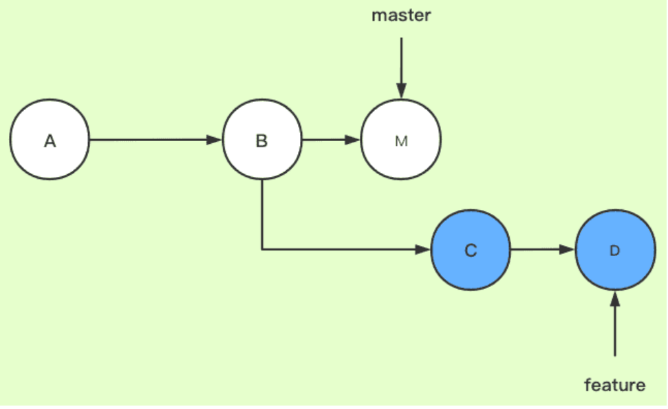

---

sidebar_label: 'Git Command'
sidebar_position: 5
---

# Git command

## Git init

````code
cd /tmp                  # 切換至 /tmp 目錄
mkdir git-practice       # 建立 git-practice 目錄
cd git-practice          # 切換至 git-practice 目錄
git init                 # 初始化這個目錄，讓 Git 對這個目錄開始進行版控
````

## Git log

git log: 檢視之前 Commit 的紀錄

```code

//outcome


commit 0d17805de091da95cc135b1a7db364ff4fd71c52
Author: xxx <zoetang852@gmail.com>
Date:   Wed Jul 31 02:12:06 2024 +0800

```

參數

* ``--stat`` :提交訊息的下方列出「被更動的檔案」、「這些檔案中有多少行被加入或移除」
* ``--oneline``
* ``--graph``

 **找某個人或某些人的 Commit…**

```code
git log --oneline --author="Sherly\|Eddie"
```

**rename git commit``--amend`` 參數只能處理最後一次的 Commit**

```code
git commit --amend -m "123"
```

## Git diff
顯示對work tree和index的更改記錄

```code
git diff
```


## Git add

git add:把全部的檔案加到暫存區

```code
git add <filename> // 把某個單一的檔案加入到暫存區
git add --all    
git add .        
```

<!-- **如果在 git add 之後又修改了那個檔案的內容?** -->

check git status:

```code
git status
```

Git 的 Commit 都只會處理暫存區（Staging Area）裡的內容

```code
commit and 說明在這次的 Commit 做了什麼
git commit -m "init commit"
```

```code
empty Commit
git commit --allow-empty -m
```

## Git add+ Git commit

```code
git commit -a -m "update content"

```

## Git merge

git merge : 合併分支的commit內容

```code

git checkout <branchName> //just to check if it in a right branch 
git merge <branchName>
```


Git merge options:
``--no-ff``：建立一個新的合併提交，即使可以進行快轉合併。
``--squash``：將所有合併的提交壓縮成一個提交。
``--abort``：如果發生衝突，中止合併程序並恢復到合併前的狀態。

**在進行 merge 之前先看看會不會發生衝突發生**

```code
git merge cat --no-commit --no-ff
```

Except result

```code
Automatic merge went well; stopped before committing as requested
```
``--no-commit``
With –no-commit perform the merge but pretend the merge failed and do not autocommit, to give the user a chance to inspect and further tweak the merge result before committing.

這個參數會假裝這次的合併失敗，並且不會產生新的 commit，讓使用者有機會可以在 commit 前再做一些事。
`` --no-ff`` :不希望 Git 使用 Fast Forward 方式合併

【狀況題】為什麼我的分支都沒有「小耳朵」？
https://gitbook.tw/chapters/branch/merge-commit

狀況題:回去上一個commit

Git rebase , Git merge ,git rebase


## Git rebase
git rebase 會將整個分支都接上去
實際操作為把B之後feature的提交先暫存下來，然後刪除原來這些提交，再找到master的最新提交位置，把存下來的提交再接上去.




https://blog.csdn.net/weixin_42310154/article/details/119004977

**Rebase 日常使用 :合併多次提交紀錄**

git cherry-pick 後面可以一次接多個 commit id
```code
git rebase -i HEAD~4
```

再簡單點的做法，可以用 cherry-pick 一個一個挑

```code
//git cherry-pick 後面可以一次接多個 commit id 

git cherry-pick id1 id2 id3
```

**接到某個提交的點**

```code
git rebase feature-b --onto eb6436 // 只要接到分支上的某個提交的點

git rebase --onto <new base-commit> <current base-commit> // 分支整個接到某個分支點上面

```

**怎麼取消 rebase？**

```code
git reset HEAD^ --hard
```

check rebase history

```code
git reflog
```


https://gitbook.tw/chapters/branch/merge-with-rebase


<!--

## git checkout

## git pull vs git fetch

## Git rebase Vs Git merge

Git Flow and JavaScript Coding Style

https://blog.wu-boy.com/2015/04/git-flow-and-javascript-coding-style

## Git reset ,git revert  ,

利用 git reset 恢復檔案、暫存狀態、commit 訊息

https://blog.wu-boy.com/2010/08/git-版本控制：利用-git-reset-恢復檔案、暫存狀態、commit-訊息

```sh
git reset –hard

// 假如將不該 commit 的程式碼都 push 到伺服器上面，例如資料庫帳號密碼，個人帳蜜等等
git reset –hard > git push –force 方式蓋掉 Server 上面的程式碼
```


## Git cherry-pick

git-cherry-pick-使用場景

https://medium.com/程式乾貨/git-cherry-pick-使用場景-59ac61723bfe

## Git fetch

## Git merge –abort

## Git checkout –theirs

## git fork

為你自己學 Git
https://gitbook.tw/chapters/rewrite-history/merge-multiple-commits-to-one-commit -->
