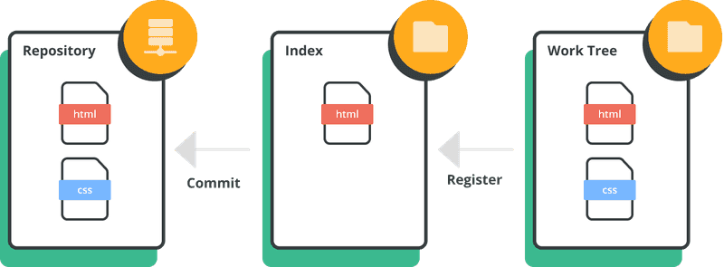
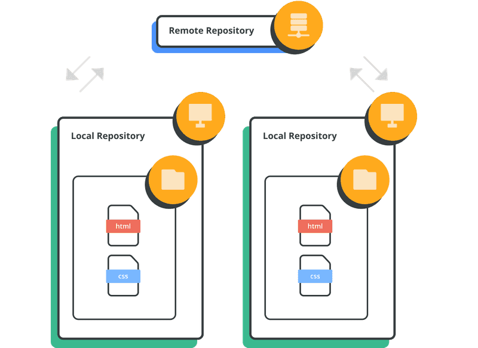
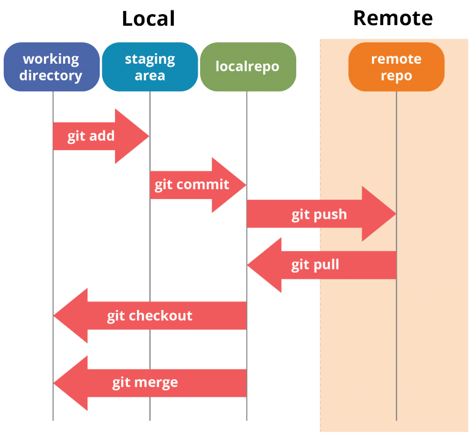
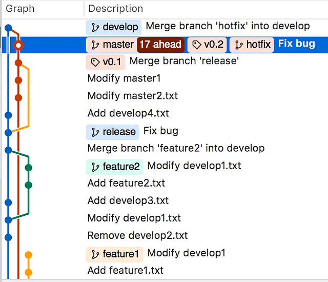

---

sidebar_label: 'Git concepts'
sidebar_position: 1

---

# Git concepts

## Git components

- 工作區(work tree)：包含目前正在編輯的文件
- 暫存區(Index)：儲存準備提交的變更
- 倉庫(Repository)：儲存所有提交的歷史記錄



**Remote repositories vs. local repositories**


## Git ORIG_HEAD 

Git 有另一個特別的紀錄點叫做``ORIG_HEAD``, 在日常使用中主要有以下幾個用途:

1. 版本回退

當執行危險操作如、或時,Git 會將HEAD 指標的原始位置記錄到ORIG_HEAD 中。如果發現操作有誤,可以使用回退到操作之前的版本``git reset``,``git merge``,``git pull``,``git reset --hard ORIG_HEAD``。

2. 恢復工作區

為了避免在回滾時清除工作區中的內容,可以使用。這裡將換成了,可以保留工作區而不是直接丟棄``git reset``。

3. 查看操作記錄

可以使用查看HEAD 的移動歷史,每筆記錄都有一個索引號。配合可以查看具體的操作記錄和提交信息``git reflog``,``git show HEAD@{index}``。

4. 保留工作區內容

假設你正在編輯文件,發現目前工作區的內容應該屬於另一個分支。此時可以開啟新分支,然後使用保留工作區內容,丟棄之前的一些提交``git reset --keep ORIG_HEAD``。


## Git workflow




## Git commit Rule

1. 標題與內容中間多一行空白
2. 標題限制 50 字元
3. 標題第一個字必須為大寫
4. 標題最後不要帶上句號
5. 標題內容可以使用強烈的語氣
6. 內容每 72 個字元斷行
7. 內容可以多解釋 what and why vs. how

偉大的 Git commit message rules||hackmd

https://hackmd.io/@howhow/git_commit

git book

https://git-scm.com/book/en/v2


## Git Branch Rule

GitHub Branch 策略 - 哪一種方式適合你? ||   iThome 鐵人賽- 不僅是程式碼代管平台 - Github 能做些什麼?  
https://ithelp.ithome.com.tw/articles/10261136

 Git 版本控制 branch model [link](https://blog.wu-boy.com/2011/03/git-%E7%89%88%E6%9C%AC%E6%8E%A7%E5%88%B6-branch-model-%E5%88%86%E6%94%AF%E6%A8%A1%E7%B5%84%E5%9F%BA%E6%9C%AC%E4%BB%8B%E7%B4%B9/)

Git Flow 也一組規則，設計用於頻繁更新版本的流程，所建立的分支如下

> feature/ ：用於開發新功能，

> bugfix/ ：修復程式碼中的錯誤。通常是與某個問題相關的。

> hotfix/ ：修復生產中的關鍵錯誤。

> release/ ：準備新版本，通常用於執行最後修改和修訂等任務。

> docs/ ：用於撰寫、修改或修正文件。



Gitmoji

Git Commit emoji Guide  提交表情使用指北

[https://hooj0.github.io/git-emoji-guide/](https://hooj0.github.io/git-emoji-guide/)

git commit emoji 使用指南 cn

https://github.com/liuchengxu/git-commit-emoji-cn

## git clone / SSH keys

SSH keys : 無需每次輸入使用者名稱和密碼

設定 Git

```sh

git config --global user.name "John Doe"
git config --global user.email johndoe@example.com

```

```sh
 ssh-keygen -t rsa -b 4096 -C "your_email@example.com"

會跳出下面這條訊息：
> Generating public/private rsa key pair.
//接著會詢問要不要設定通行密碼，再輸入一次後確認：
> Enter passphrase (empty for no passphrase): [Type a passphrase]
> Enter same passphrase again: [Type passphrase again]

```

- go  /c/Users/A/.ssh/id , check id_rsa.pub, get ssh key
- github setting > ssh key

設定檔的位置

- ~/.gitconfig

Setup git clone with SSH keys 或 HTTPS 設定步驟  | Medium
https://tsengbatty.medium.com/git-%E8%B8%A9%E5%9D%91%E7%B4%80%E9%8C%84-%E4%BA%8C-git-clone-with-ssh-keys-%E6%88%96-https-%E8%A8%AD%E5%AE%9A%E6%AD%A5%E9%A9%9F-bdb721bd7cf2

SSH 連線設定 | Git tutorial | Nulab
https://nulab.com/zh-tw/learn/software-development/git-tutorial/git-commands-settings/ssh-connection-settings/


## Setting:Set Up Multiple GitHub Accounts

 Setting: GitHub Account Two-factor authentication

Two-factor authentication :使用手機登入github應用程式

GitHub Account Security - Two-factor authentication

https://ithelp.ithome.com.tw/articles/10270888


## Setting: Github PR

不僅是程式碼代管平台 - Github 能做些什麼? || 2021 iThome 鐵人賽

https://ithelp.ithome.com.tw/users/20091494/ironman/4464

GitHub Flow 及 Git Flow 流程使用時機

要熟悉 Git 整個流程，依賴 SourceTree 這工具，然而這工具真的害死一堆剛入門的朋友，不好好學 command，一開始就碰 SourceTree，你根本不知道 SourceTree 在背景做了哪些事情。

https://blog.wu-boy.com/2017/12/github-flow-vs-git-flow/

在Git中，有幾個指令可以使用他人的版本來解決衝突。以下是五個常用的命令：

```text
git fetch：使用此指令從遠端倉庫拉取最新的程式碼，但不會自動合併到目前工作分支。

git merge：使用此指令將拉取的最新版本合併到目前工作分支。如果在合併過程中出現衝突，你需要手動解決衝突。

git rebase：使用此指令將目前工作分支的提交放在最新版本的基礎上重新套用。如果有衝突，你需要手動解決衝突。

git cherry-pick：使用此指令選擇某個特定的提交並將其套用到目前工作分支。如果選擇的提交有衝突，需要手動解決衝突。

git revert：使用此指令撤銷某個特定的提交，即建立一個新的提交，以撤銷先前的變更。這是一種非破壞性的操作，不會改變歷史提交記錄。
```

git wiki

https://www.runoob.com/git/git-basic-operations.html

Git tutorial | Nulab
https://nulab.com/zh-tw/learn/software-development/git-tutorial/git-basics/what-is-git/git-components/