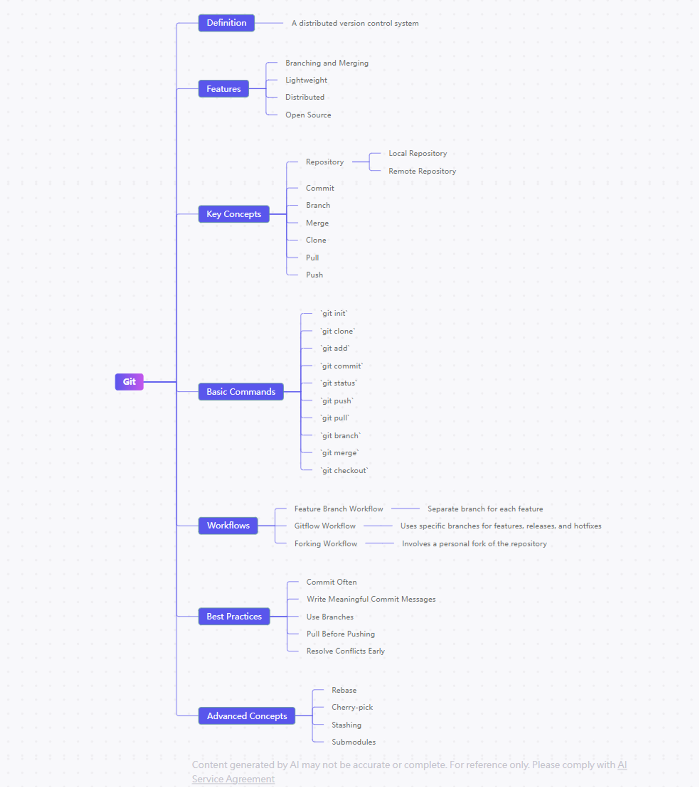

# Git

## Git book 247

https://git-scm.com/book/zh-tw/v2/%E9%96%8B%E5%A7%8B-%E9%97%9C%E6%96%BC%E7%89%88%E6%9C%AC%E6%8E%A7%E5%88%B6

## ref
Learn-Git-in-30-days

https://github.com/doggy8088/Learn-Git-in-30-days/blob/master/zh-tw/01.md

Git 教學 - Git 書 - 為你自己學 Git | 高見龍
https://gitbook.tw/

Git
https://zlargon.gitbooks.io/git-tutorial/content/branch/rebase.html

Git tutorial | Nulab
https://nulab.com/zh-tw/learn/software-development/git-tutorial/git-commands-settings/remote-git-commands/

Git從頭到尾的詳細介紹. Git版控介紹 — 前言 Git的由來 | by LowSugarCoke | Medium
https://medium.com/@jack20499/git-%E5%BE%9E%E6%96%B0%E6%89%8B%E5%88%B0%E5%85%A5%E9%96%80-%E5%BE%9E%E5%85%A5%E9%96%80%E5%88%B0%E5%B0%88%E6%A5%AD-540289ebe4ce

Git 和 GitHub 零基礎快速上手|| YT
https://www.youtube.com/watch?v=FKXRiAiQFiY

learn git gaming
https://learngitbranching.js.org/?locale=en_US

 Git 常用指令
https://medium.com/@wadehuang.developer/git-15-git-%E5%B8%B8%E7%94%A8%E6%8C%87%E4%BB%A4-git-rebase-7e4ed0b419d0

## Git rebase
Rebase — Practical guide for git users 0.1 文档
https://git-tutorial.readthedocs.io/zh/latest/rebase.html

## Git Pull

https://www.youtube.com/watch?v=xN1-2p06Urc&list=WL&index=70

## Git rebase , conflicts

https://youtu.be/DkWDHzmMvyg?si=7uCzYA31yuIS_OMG

## Git Cheat Sheet

https://doabledanny.gumroad.com/l/git-cheat-sheet-poster

## git reset & git checkout
git reset & git checkout（CC字幕） - YouTube
https://www.youtube.com/watch?v=TjHslMeJ81k&list=PLz-S_Wd1N3svV8XnuDM6CPaTCtQkk5SY4&index=2

## git merge 

- fast-forwardb
- 合併衝突

一起來學 Git 吧！(20) - Git 分支：分支合併篇 - iT 邦
https://ithelp.ithome.com.tw/articles/10334601

