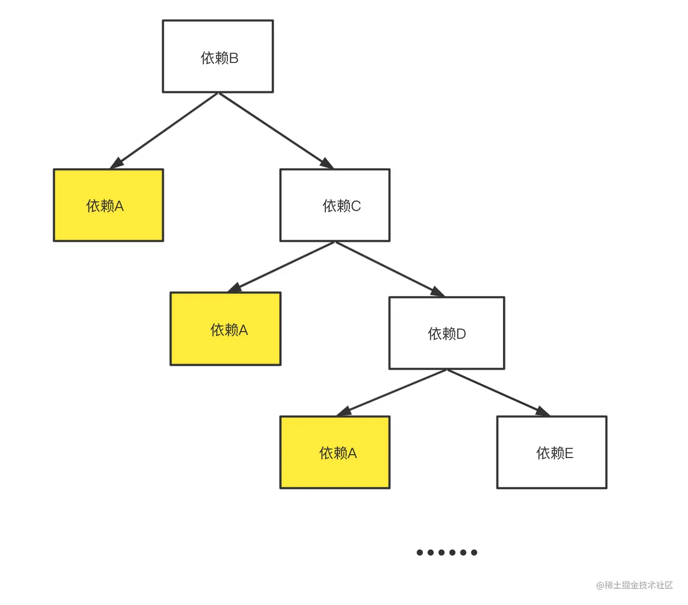

---

sidebar_label: 'Pnpm'
sidebar_position: 3

---

# Pnpm

優點:節省磁碟空間

使用npm 時，如果你有100 個項目，並且所有項目都有一個相同的依賴包，那麼， 你在硬碟上就需要保存100 份該相同依賴包的副本


如果是使用pnpm，依賴套件將會被存放在一個統一的位置。每一個文件都單獨進行儲存到倉庫

```text
-pnpm cicd /docker /git
```

淺談 JS 生態系的套件管理機制與發展. 過去我總認為 JavaScript… | by 莫力全 Kyle Mo | Medium

https://oldmo860617.medium.com/%E6%B7%BA%E8%AB%87-js-%E7%94%9F%E6%85%8B%E7%B3%BB%E7%9A%84%E5%A5%97%E4%BB%B6%E7%AE%A1%E7%90%86%E6%A9%9F%E5%88%B6%E8%88%87%E7%99%BC%E5%B1%95-5cb10b7e2f72

error: 'pnpm' 不是內部或外部命令,也不是可運行的程式或批次文件

https://blog.csdn.net/qq_44622894/article/details/128076887?utm_medium=distribute.pc_relevant.none-task-blog-2~default~baidujs_baidulandingword~default-0-128076887-blog-126139139.235^v43^pc_blog_bottom_relevance_base9&spm=1001.2101.3001.4242.1&utm_relevant_index=3
