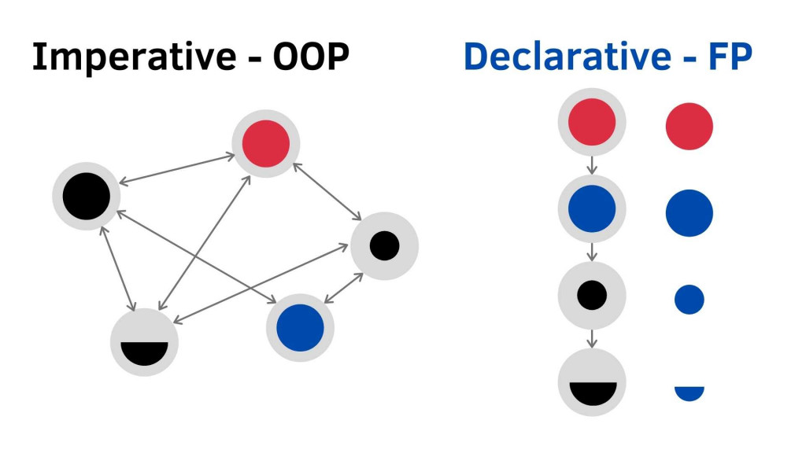

---

sidebar_label: 'Functional Programming'
sidebar_position: 5

---

# Functional Programming

Functional programming is Declarative Paradigm(宣告式)

e.g React is declarative.

## Declarative 宣告式 Vs Imperative 命令式

Functional Programming in JS系列 Declarative vs. Imperative

https://ithelp.ithome.com.tw/articles/10233761